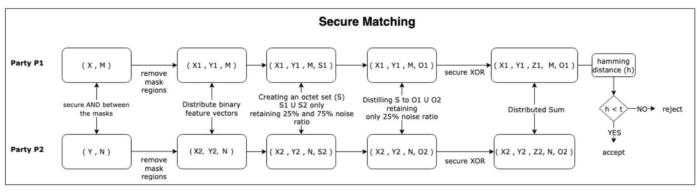
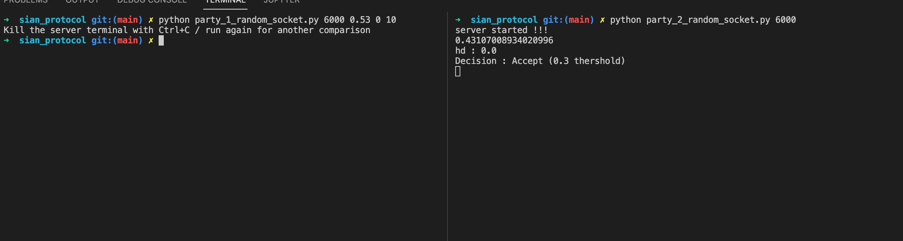

 ### Algorithm:
 
 
 ### Setup:
 ```
 pip install -r requirements.txt
 ```

 
 ### General Information for local testing: 
 * Open two terminals
 * Start party_2*.py first which is the server and then run party_1*.py with appropriate arguments. 
 

### Single image with custom noise

To test the protocol in all possible cases, we can introduce custom noise in feature and noise vectors. It compares the noise introduced image with the reference at the server.

Run as :
 ```
 python <party_type_random_socket.py> <port> <custom noise vector noise in [0, 1]> <custom feature noise in [0, 1]> <k value / default 0>
 ```

#### Example   :
 ```
 python party_2_random_socket.py 6000 
 python party_1_random_socket.py 6000 0.53 0 10
 ```
 Something like this can be observed : <br><br>
 


 

 #### For larger feature vectors : 
 * Adjust the angular and radial resolution parameters.
 * Edit random_client_key.json with the corresponding sized keys, set key_default variable
 * Use https://www.browserling.com/tools/random-bin for large generation
